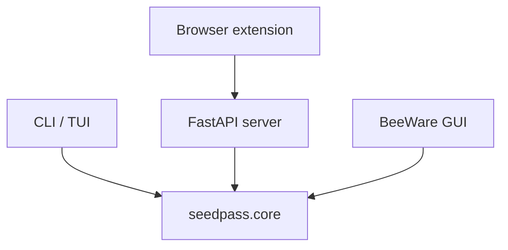

# SeedPass Architecture

SeedPass follows a layered design that keeps the security-critical logic isolated in a reusable core package. Interfaces like the command line tool, REST API and graphical client act as thin adapters around this core.

## Core Components

- **`seedpass.core`** – houses all encryption, key derivation and vault management code.
- **`VaultService`** and **`EntryService`** – thread-safe wrappers exposing the main API.
- **`PasswordManager`** – orchestrates vault operations, migrations and Nostr sync.

## Adapters

- **CLI/TUI** – implemented in [`seedpass.cli`](src/seedpass/cli.py). The [Advanced CLI](docs/docs/content/01-getting-started/01-advanced_cli.md) guide details all commands.
- **FastAPI server** – defined in [`seedpass.api`](src/seedpass/api.py). See the [API Reference](docs/docs/content/01-getting-started/02-api_reference.md) for endpoints.
- **BeeWare GUI** – located in [`seedpass_gui`](src/seedpass_gui/app.py) and explained in the [GUI Adapter](docs/docs/content/01-getting-started/06-gui_adapter.md) page.

## Planned Extensions

SeedPass is built to support additional adapters. Planned or experimental options include:

- A browser extension communicating with the API
- Automation scripts using the CLI
- Additional vault import/export helpers described in [JSON Entries](docs/docs/content/01-getting-started/03-json_entries.md)

## Overview Diagram

All adapters depend on the same core, allowing features to evolve without duplicating logic across interfaces.
