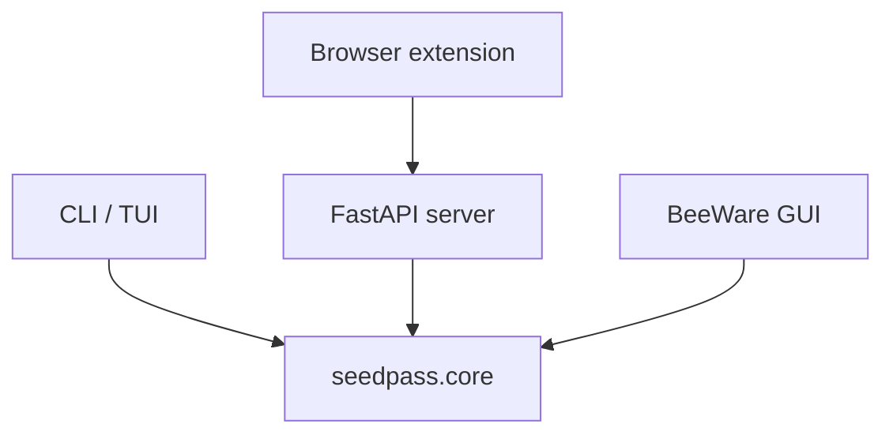

# SeedPass Architecture

SeedPass follows a layered design that keeps the security-critical logic isolated in a reusable core package. Interfaces like the command line tool, REST API and graphical client act as thin adapters around this core.

## Core Components

- **`seedpass.core`** – houses all encryption, key derivation and vault management code.
- **`VaultService`** and **`EntryService`** – thread-safe wrappers exposing the main API.
- **`PasswordManager`** – orchestrates vault operations, migrations and Nostr sync.

## Adapters

- **CLI/TUI** – implemented in [`seedpass.cli`](../src/seedpass/cli/__init__.py). Use `seedpass --help` and `seedpass <command-group> --help` for command-level docs.
- **FastAPI server** – defined in [`seedpass.api`](../src/seedpass/api.py).
- **BeeWare GUI** – located in [`seedpass_gui`](../src/seedpass_gui/app.py). Packaging and install notes are in [packaging.md](packaging.md).

## Planned Extensions

SeedPass is built to support additional adapters. Planned or experimental options include:

- A browser extension communicating with the API
- Automation scripts using the CLI
- Additional vault import/export helpers are available through the CLI (`seedpass vault --help`) and implemented in [`seedpass.cli.vault`](../src/seedpass/cli/vault.py).

## Overview Diagram

```mermaid
graph TD
    core["seedpass.core"]
    cli["CLI / TUI"]
    api["FastAPI server"]
    gui["BeeWare GUI"]
    ext["Browser extension"]

    cli --> core
    api --> core
    gui --> core
    ext --> api
```

All adapters depend on the same core, allowing features to evolve without duplicating logic across interfaces.
