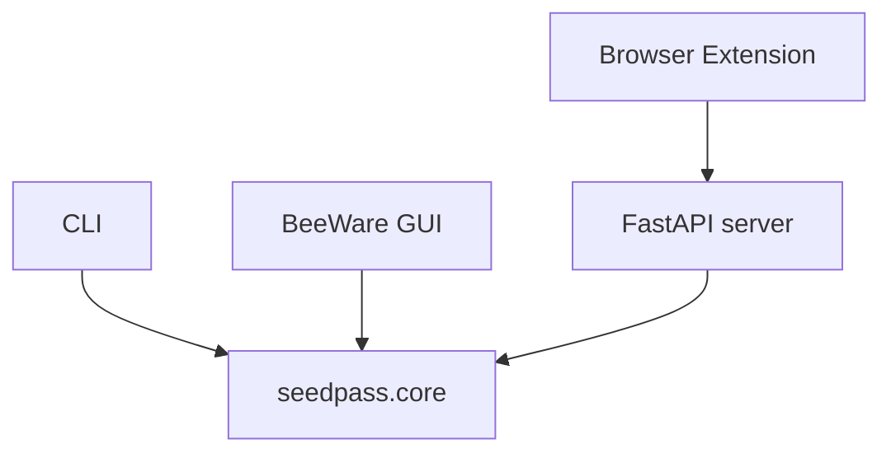

# BeeWare GUI Adapter

SeedPass ships with a proof-of-concept graphical interface built using [BeeWare](https://beeware.org). The GUI interacts with the same core services as the CLI by instantiating wrappers around `PasswordManager`.


## Getting Started with the GUI

After installing the project dependencies, launch the desktop interface with one
of the following commands:

```bash
seedpass gui
python -m seedpass_gui
seedpass-gui
```

Only `toga-core` and the headless `toga-dummy` backend ship with the project.
The installation scripts automatically install the correct BeeWare backend so
the GUI works out of the box. If you set up SeedPass manually, install the
backend for your platform:

```bash
# Linux
pip install toga-gtk

# Windows
pip install toga-winforms

# macOS
pip install toga-cocoa
```

The GUI shares the same encrypted vault and configuration as the command line tool.

To generate a packaged binary, run `briefcase build` (after the initial `briefcase create`).



## VaultService and EntryService

`VaultService` provides thread-safe access to vault operations like exporting, importing, unlocking and locking the vault. `EntryService` exposes methods for listing, searching and modifying entries. Both classes live in `seedpass.core.api` and hold a `PasswordManager` instance protected by a `threading.Lock` to ensure safe concurrent access.

```python
class VaultService:
    """Thread-safe wrapper around vault operations."""
    def __init__(self, manager: PasswordManager) -> None:
        self._manager = manager
        self._lock = Lock()
```

```python
class EntryService:
    """Thread-safe wrapper around entry operations."""
    def __init__(self, manager: PasswordManager) -> None:
        self._manager = manager
        self._lock = Lock()
```

## BeeWare Windows

The GUI defines two main windows in `src/seedpass_gui/app.py`. `LockScreenWindow` prompts for the master password and then opens `MainWindow` to display the vault entries.

```python
class LockScreenWindow(toga.Window):
    """Window prompting for the master password."""
    def __init__(self, app: SeedPassApp, vault: VaultService, entries: EntryService) -> None:
        super().__init__("Unlock Vault")
        self.app = app
        self.vault = vault
        self.entries = entries
        ...
```

```python
class MainWindow(toga.Window):
    """Main application window showing vault entries."""
    def __init__(self, app: SeedPassApp, vault: VaultService, entries: EntryService) -> None:
        super().__init__("SeedPass")
        self.app = app
        self.vault = vault
        self.entries = entries
        ...
```

Each window receives the service instances and calls methods such as `vault.unlock()` or `entries.add_entry()` when buttons are pressed. This keeps the UI thin while reusing the core logic.

## Asynchronous Synchronization

`PasswordManager` performs network synchronization with Nostr using `asyncio`. Methods like `start_background_vault_sync()` create a coroutine that calls `sync_vault_async()` in a background thread or task without blocking the UI.

```python
async def sync_vault_async(self, alt_summary: str | None = None) -> dict[str, list[str] | str] | None:
    """Publish the current vault contents to Nostr and return event IDs."""
    ...
```

```python
def start_background_vault_sync(self, alt_summary: str | None = None) -> None:
    if getattr(self, "offline_mode", False):
        return
    def _worker() -> None:
        asyncio.run(self.sync_vault_async(alt_summary=alt_summary))
    try:
        loop = asyncio.get_running_loop()
    except RuntimeError:
        threading.Thread(target=_worker, daemon=True).start()
    else:
        asyncio.create_task(self.sync_vault_async(alt_summary=alt_summary))
```

This approach ensures synchronization happens asynchronously whether the GUI is running inside or outside an existing event loop.

## Relay Manager and Status Bar

The *Relays* button opens a dialog for adding or removing Nostr relay URLs. The
status bar at the bottom of the main window shows when the last synchronization
completed. It updates automatically when `sync_started` and `sync_finished`
events are published on the internal pubsub bus.

When a ``vault_locked`` event is emitted, the GUI automatically returns to the
lock screen so the session can be reopened with the master password.


## Event Handling

The GUI subscribes to a few core events so the interface reacts automatically when the vault changes state. When `MainWindow` is created it registers callbacks for `sync_started`, `sync_finished` and `vault_locked` on the global pubsub `bus`:

```python
bus.subscribe("sync_started", self.sync_started)
bus.subscribe("sync_finished", self.sync_finished)
bus.subscribe("vault_locked", self.vault_locked)
```

Each handler updates the status bar or returns to the lock screen. The `cleanup` method removes these hooks when the window closes:

```python
def cleanup(self, *args: object, **kwargs: object) -> None:
    bus.unsubscribe("sync_started", self.sync_started)
    bus.unsubscribe("sync_finished", self.sync_finished)
    bus.unsubscribe("vault_locked", self.vault_locked)
```

The [TOTP window](../../02-api_reference.md#totp) demonstrates how such events keep the UI fresh: it shows live two-factor codes that reflect the latest vault data after synchronization.
